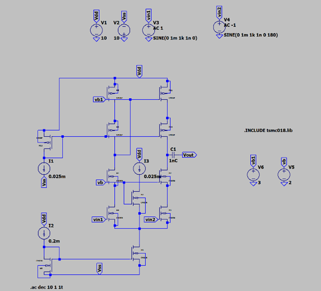
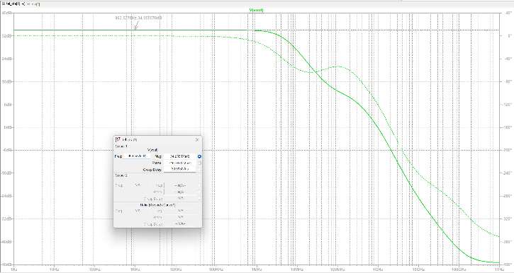
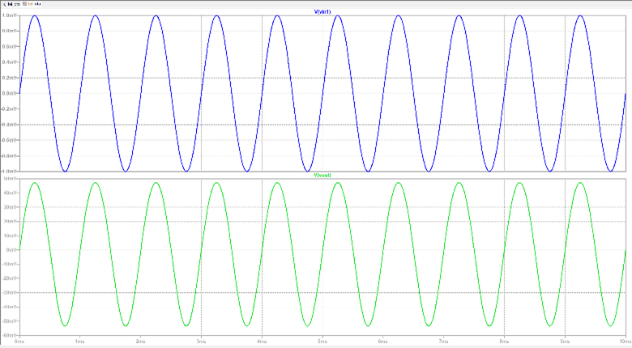

# Telescopic Cascode CMOS OTA Design

## Abstract

This project presents the design and analysis of a **Telescopic Cascode Operational Transconductance Amplifier (OTA)** using CMOS technology. The OTA is designed to deliver **high DC gain**, **large output impedance**, and **low power operation** with a supply voltage of **1.8V**. By utilizing a differential input stage cascoded with NMOS and PMOS transistors, the amplifier achieves significant gain enhancement while retaining a compact and simple single-stage structure. Simulations verify performance metrics such as gain, bandwidth, swing, and stability.

## 1. Introduction

Operational Transconductance Amplifiers (OTAs) serve as core building blocks in analog systems like filters, ADCs, and sensor interfaces. The **Telescopic Cascode OTA** stands out among OTA topologies for offering:

- High intrinsic gain  
- Wide bandwidth  
- Low power consumption  
- Simplicity due to a single-stage structure

Unlike Miller-compensated multi-stage designs, the telescopic OTA maintains **stability** and **performance** without extra compensation techniques.

## 2. Circuit Architecture

The circuit includes:
- Differential pair: **M1, M2 (NMOS)**
- Cascode NMOS: **M6, M7**
- Cascode PMOS current mirror: **M3, M4, M8, M9**
- Output node: Between NMOS cascode and PMOS load
- Biasing: Tail current source and current mirror

The stacked configuration increases output resistance, enabling higher gain.

## 3. Working Principle

When a differential input (vid) is applied:
- The input transistors (M1, M2) modulate the tail bias current.
- The variation is mirrored via PMOS cascode (M3–M4–M8–M9).
- If `vid = 0`, symmetry ensures no output swing.
- For `vid ≠ 0`, the differential current creates an output swing proportional to `gm × vid`.

The **cascode configuration boosts output resistance**, improving gain:

r_out ≈ ro_M6 × (gm_M6 × ro_M2) × ro_PMOS_mirror

## 4. Design Specifications

| Parameter                  | Target / Observed Value      |
|----------------------------|------------------------------|
| **Supply Voltage (Vdd)**   | **1.8 V**                    |
| Input Transconductance (gm)| Based on sizing of M1, M2   |
| DC Gain (Ao)               | 34.05 dB ≈ **50.04 V/V**     |
| 3-dB Bandwidth (f₃dB)      | ~963.5 Hz                    |
| Unity Gain Bandwidth       | 50 kHz – 100 kHz             |
| Input Swing                | ±1 mV                        |
| Output Swing               | ±50 mV peak (100 mVpp)       |
| Output Resistance (r_out)  | Enhanced via cascoding       |

## 5. Simulation Results

### 5.1 DC Gain and AC Frequency Response

AC analysis yields:
- **Midband Gain**: 34.05 dB → \( A_0 = 10^{34.05/20} = 50.04 \, \text{V/V} \)
- **3-dB Bandwidth**: ~963.5 Hz
- **UGBW**: Between 50–100 kHz

### 5.2 Transient Simulation

A sinusoidal input (±1 mV @ 1 kHz) produces a clean output sine wave of ±50 mV, validating the expected gain and linear small-signal behavior.

### 5.3 Phase Response

The phase plot exhibits standard single-pole roll-off behavior. A full phase margin is not directly calculated but inferred to be stable due to the topology’s single-stage nature and lack of internal poles.

## 6. Input/Output Swing Characteristics

- **Input**: ±1 mV (differential mode)  
- **Output**: ±50 mV peak (~100 mVpp)  
- The headroom is maintained due to stacking in the telescopic structure.

## 7. Stability Analysis

This OTA is inherently stable due to:
- **Single-pole frequency response**
- **High output impedance**
- No need for compensation (e.g., Miller capacitors)

## 8. Applications

This OTA is ideal for precision, low-power analog systems such as:
- Neural signal acquisition circuits  
- Switched-capacitor integrators  
- Low-power analog computation  
- High-gain front-end amplifiers  

## 9. Conclusion

The telescopic cascode OTA achieves high gain and low power consumption with compact design. The trade-off in swing range is justified by its simplicity and efficiency, making it an excellent candidate for analog front-end blocks operating on **1.8V supply**.

## 10. Acknowledgement

We sincerely thank **Dr. Remya Jayachandran**, Department of Electronics and Communication Engineering, NIE Mysore, for her guidance and encouragement in completing this work.

## 11. References

1. B. Razavi, *Design of Analog CMOS Integrated Circuits*, McGraw-Hill, 2001  
2. P. R. Gray, P. J. Hurst, S. H. Lewis, R. G. Meyer, *Analysis and Design of Analog Integrated Circuits*, Wiley, 2009  
3. Y. Tsividis, C. McAndrew, *Operation and Modeling of the MOS Transistor*, Oxford Univ. Press, 2011  
4. D. A. Johns, K. Martin, *Analog Integrated Circuit Design*, Wiley, 1997  
5. P. E. Allen, D. R. Holberg, *CMOS Analog Circuit Design*, Oxford Univ. Press, 2002

## Contributors

- Ballambettu Milan Shankar Bhat (4NI23EC019) 
- Anirudha Jayaprakash (4NI23EC014)
